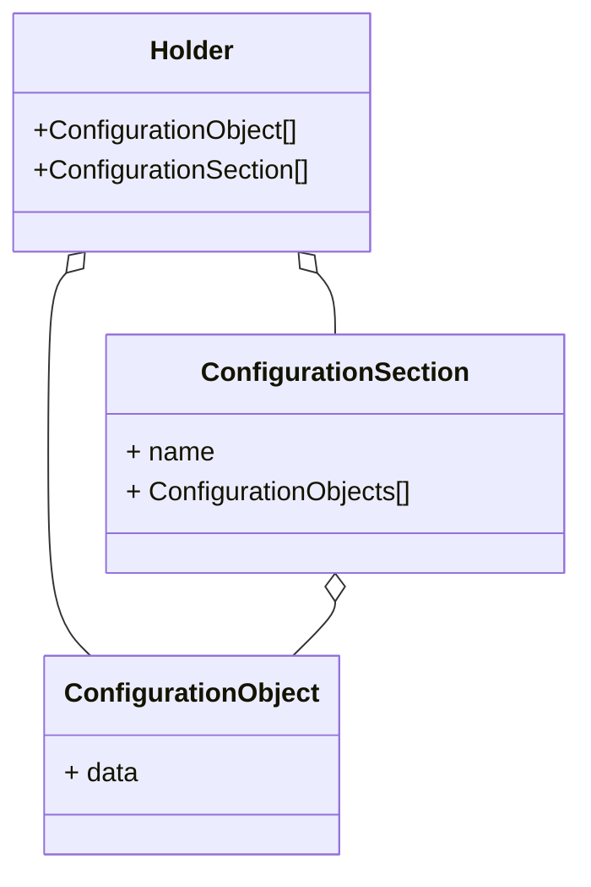

# Handling Configuration 

We can handle configuration quite easily using either Yaml configuration files or In Memory objects.
The Yaml declarative strategy is the preferred one for any environment other than running automated tests.

# How configuration is structured

The configuration can be seen as a small composite and is designed to structure the configuration in a declarative way.
The innermost configuration container is called an `ConfigurationObject`. It is used for declaring values that can 
be later mapped in a configuration model in the code.
The layer above is the `ConfigurationSection`. Its purpose is simply to help organize and structure the configuration.
Finally, the outermost layer is called the `ConfigurationHolder` which aggregates both `ConfigurationSection` and 
`ConfigurationObject` at the same time.

We have the following composite representation:



# Use cases
## Declaring a new configuration object
The simplest use case is to declare a new configuration object. Let's say we want to
declare a remote server to be used later in the code.

```python
from pydantic import Field
from monitor_server.infrastructure.config import ConfigurationBase

class ServerConfig(ConfigurationBase, declared_as="my_remote_server"):
    host: str
    port: int = Field(default=8080)
    driver: str | None = None
```

With this python snippet we link a pydantic object (`ServerConfig`) to a configuration key (line 5).
We thus have defined a `ConfigurationObject` named `my_remote_server` that will be mapped in the code by
a `ServerConfig` model which is nothing more than a pydantic model.

Now, say we want to use a yaml declaration. It would basically look like this:
```yaml
my_remote_server:
  host: localhost
  port: 8091
  driver: 'driver::'
```
Neat, isn't it?
## Referencing another object
In some case, we want to have a single definition point that can spread on all the configuration.
This can easily be achieved with the notion of references.
Let's consider that we now want to configure a database connection, and we wish to reuse the server
declaration...

We can define our connection like this:

```python
from pydantic import Field
from monitor_server.infrastructure.config import ConfigurationBase

class ServerConfig(ConfigurationBase, declared_as="my_remote_server"):
    host: str
    port: int = Field(default=8080)
    driver: str | None = None


class SQLConnection(ConfigurationBase, declare_as="sql_connection"):
    server: ServerConfig
    echo_requests: bool
    user: str
    password: str
```

We could have the following declaration using yaml in a file called `config.yaml`:
```yaml
my_remote_server:
  host: localhost
  port: 8091
  driver: 'driver::'

sql_connection:
  my_remote_server:
    host: localhost
    port: 8091
    driver: 'driver::'
  echo_requests: false
  user: me
  password: s€cret
```

As you can see, it is pretty redundant. Let's split it in two files:

- `global.yaml` which will host the global settings
- `sql.yaml` which will contain the details for the sql engine

```yaml 
# File global.yaml
my_remote_server:
  host: localhost
  port: 8091
  driver: 'driver::'
```

```yaml 
# File sql.yaml
sql_connection:
  echo_requests: false
  user: me
  password: s€cret
  .ref: global.my_remote_server
```
The `.ref` link will instruct the configuration to merge the data of `my_remote_server` in `sql_connection` under an 
element named `my_remote_server`.
This can be applied to any data as long as you keep this composite structure.

## Using section
Let's take the previous example back.
We can categorize the server connection under a `connection` section for clarity's sake.
Without changing the python definition, the configuration would look like:

```yaml 
# File global.yaml
connections:
  my_remote_server:
    host: localhost
    port: 8091
    driver: 'driver::'
```

```yaml 
# File sql.yaml
sql_connection:
  echo_requests: false
  user: me
  password: s€cret
  .ref: global.connections.my_remote_server
```

Note how the `.ref` link has been updated. Nothing else is required 

## About holders
Holders are not a big deal from a developer point of view. It basically represents the file in all our previous example.
This means that:
- `global.yaml` will be managed by the holder named `global`
- `sql.yaml` will be managed by the holder named `sql`

Their main use is for referencing an object in another.

## Fetch a specific configuration object
Consider the following configuration base:
```python
from pydantic import Field
from monitor_server.infrastructure.config import ConfigurationBase

class ServerConfig(ConfigurationBase, declare_as="my_remote_server"):
    host: str
    port: int = Field(default=8080)
    driver: str | None = None
```

We can retrieve the associated configuration quite easily using a `ConfigurationKey` which will
map the type to the object:
```python
from monitor_server.infrastructure.config import ConfigurationBase, get_app_config

class ServerConfig(ConfigurationBase, declare_as="my_remote_server"):
    host: str
    port: int
    driver: str | None = None

# After having read your configuration ...
my_value = get_app_config()[ServerConfig]
print(my_value.model_dump())  # <-- This is a pydantic object!
```

## Reading configuration
Any configuration is read by the `ConfigurationLoader` using :

- a discovery service, whose role is to fetch all holders 
- a loader which read the different holders one by one to make them usable from the `ApplicationConfig` point of view.

### Using a Yaml reader
This reader uses a file discovery approach to load the different yaml.
A possible way to use it may be:

```python
import pathlib
from monitor_server.infrastructure.config import (
    get_app_config, 
    ConfigurationBase,
    YamlReader,
    FileDiscoveryService,
    ConfigService
)


class ServerConfig(ConfigurationBase, declare_as="my_remote_server"):
    host: str
    port: int
    driver: str | None = None

discovery_service = FileDiscoveryService(
    root_path=pathlib.Path(__file__) / 'application' / 'config' / 'mode',
    ext=YamlReader.suffixes
)

a_config_service = ConfigService(YamlReader(), discovery_service, get_app_config())
get_app_config().declare(ServerConfig)
a_config_service.resolve()

my_value = get_app_config()[ServerConfig]
```

### Using an InMemory reader
Kind of the same way:
```python
from monitor_server.infrastructure.config import (
    get_app_config,
    ConfigurationBase,
    InMemoryConfig,
    MemoryReader,
    MemoryDiscoveryService,
    ConfigService
)


class ServerConfig(ConfigurationBase, declared_as="my_remote_server"):
    host: str
    port: int
    driver: str | None = None


discovery_service = MemoryDiscoveryService(
    # This would have been previously populated. See tests to get more details 
    root_path=InMemoryConfig({"my_remote_server": {"host": "local.host.net"}}),
)

a_config_service = ConfigService(MemoryReader(), discovery_service, get_app_config())
a_config_service.resolve()

my_value = get_app_config()[ServerConfig]
```